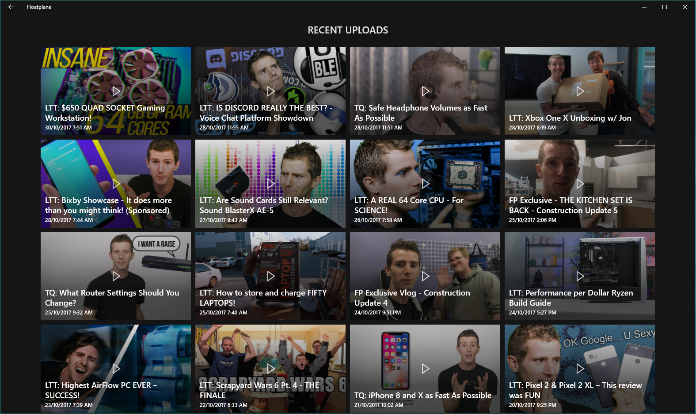

# Floatplane UWP App

This repo contains an unofficial UWP app for Floatplane. It's still in heavy development but the basics work.

## Features
- Login to your Floatplane account (messy process, but it works).
- View a list of recent videos with auto loading of more videos when your scroll down.
- Watch videos at 720p.
- Auto download videos to specified location.

## Todo
- Split recent video feed into the three channels.
- Views/Comments support.
- View Comments.
- Change video quality.
- Screenshots of app.

## How it works
1. Display a webview to the LTT forum login page. When they login they click the "I've logged in button". Cookies and local cache are saved.
2. Read through the Floatplane RSS feed grabbing useful info (video id), and building strings (thumbnail url).
3. When the user clicks on the video, grab the video url using the VideoHelpers class. 
4. Play the video through the media element.
